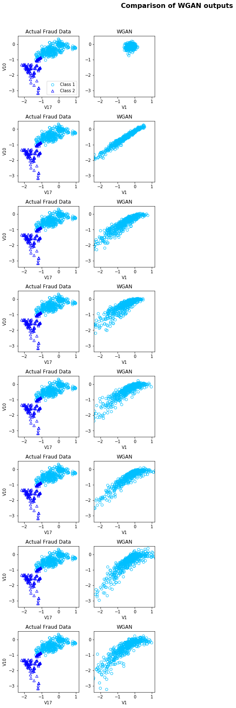
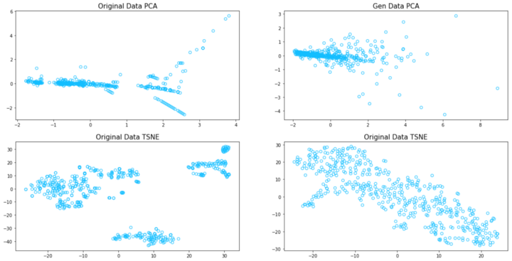

# Como gerar dados sintéticos?
## Um repositório dedicado à geração de dados sintéticos

Esta é uma frase que está se tornando comum, mas ainda é verdade e reflete a tendência do mercado, [Dados são o novo petróleo](https://www.economist.com/leaders/2017/05/06/the-worlds-most-valuable-resource-is-no-longer-oil-but-data). Alguns dos maiores players do mercado já têm o controle mais forte sobre essa moeda. Quando se trata de aprendizado de máquinas, definitivamente os dados são um pré-requisito, e embora a barreira de entrada no mundo dos algoritmos seja hoje em dia menor do que antes, ainda existem muitas barreiras no que diz respeito ao uso de dados em problemas do mundo real — algumas vezes o acesso é restrito, outras não há dados suficientes para obter bons resultados, a variabilidade não é suficiente para a generalização do modelo, e a lista continua.

Por estas razões, a [geração de dados sintéticos](https://arxiv.org/abs/1909.11512) é uma das novas habilidades obrigatórias para os cientistas de dados!

#### Afinal de contas, o que são dados sintéticos?

Os dados sintéticos podem ser definidos como quaisquer dados que não foram coletados de eventos do mundo real, ou seja, são gerados por um sistema, com o objetivo de imitar dados reais em termos de características essenciais. Existem algoritmos específicos que são projetados e [capazes de gerar dados sintéticos realistas](https://medium.com/ydata-ai/synthetic-data-1cd0ba907609?source=friends_link&sk=9bc08310a942cf59a974055daa1aa315) que podem ser usados como um conjunto de dados de treinamento. Os dados sintéticos oferecem vários benefícios: privacidade, pois todas as informações pessoais foram removidas e os dados não podem ser rastreados até serem menos caros e mais rápidos de coletar quando comparados à coleta de dados do mundo real.

----------

### Os algoritmos que você deve conhecer e precisar!

Existem vários métodos diferentes para gerar dados sintéticos, alguns deles muito familiares às equipes de ciência de dados, tais como [SMOTE ou ADYSIN](https://medium.com/coinmonks/smote-and-adasyn-handling-imbalanced-data-set-34f5223e167), no entanto, quando se trata de gerar dados sintéticos realistas, teremos que dar uma olhada em outros algoritmos familiares — Redes Geradoras Profundas. O repositório que vou cobrir neste post do blog é uma [compilação de diferentes algoritmos generativos para gerar dados sintéticos](https://github.com/ydataai/ydata-synthetic).

----------

#### Geração de dados sintéticos com WGAN

A Wasserstein GAN é considerada como uma extensão da rede Generativa Adversarial introduzida por Ian Goodfellow. A WGAN foi introduzida por Martin Arjovsky em 2017 e promete melhorar tanto a estabilidade no treinamento do modelo quanto introduzir uma função de perda que seja capaz de se correlacionar com a qualidade dos eventos gerados. Legal, certo? Mas quais são as principais diferenças introduzidas com a WGAN?

#### O que há de novo na WGAN?

Em vez de usar o conceito de “Discriminador” para classificar ou prever a probabilidade de um determinado evento gerado como sendo real ou falso, essa GAN introduz o conceito de “Crítico” que, em poucas palavras, pontua a veracidade ou falsidade de um determinado evento. Esta mudança se deve principalmente ao fato de que enquanto treinamos um gerador, teoricamente devemos buscar a minimização da distância entre a distribuição dos dados observados no conjunto de dados de treinamento e a distribuição observada nos exemplos gerados.

Podemos resumir as principais diferenças introduzidas pela WGAN como as seguintes:

1.  Usar uma nova função de perda derivada da distância de Wasserstein.
2.  Após cada atualização de gradiente na função crítica, fixe os pesos a uma pequena faixa fixa, [-c,c]. Isto permite aplicar a restrição de Lipschitz.  
    Alternativa proposta ao Discriminador — o Crítico.
3.  Uso de uma função de ativação linear como a linear de saída da rede do Critic.
4.  Número diferente de atualizações para o Gerador e para as Redes Críticas.

### Os benefícios

As mudanças mencionadas anteriormente e introduzidas com a WGAN trazem uma série de benefícios durante o treinamento dessas redes:

-   O treinamento de uma WGAN é mais estável quando comparado, por exemplo, com o GAN proposto originalmente.
-   É menos sensível à seleção de modelos de arquitetura (Gerador e Escolha Crítica)
-   Além disso, é também menos sensível e impactada pela escolha dos hiperparâmetros — embora ainda seja muito importante para alcançar bons resultados.
-   Finalmente, somos capazes de correlacionar a perda do crítico com a qualidade geral dos eventos gerados.

#### Implementação com Tensorflow 2.0

Agora o que completamos as importações vamos para as redes: o Gerador e o Crítico.

Da mesma forma que o Gerador, decidi optar por uma simples rede para o Crítico. Aqui, tenho uma rede de 4 camadas densas com, também, ativação Relu. Realçanco um pouco aqui a última linha de código — diferente da Vanilla GAN, onde normalmente adicionamos esta como a última camada da rede:

    x = Dense(1, activation=’sigmoid’)(x))

Ela usa a função sigmóide na camada de saída do discriminador, o que significa que ele prevê a probabilidade de um determinado evento ser real. Quando se trata da WGAN, o modelo crítico requer uma ativação linear, a fim de prever a pontuação da “realidade” de um determinado evento.

    x = Dense(1)(x)

ou

    x = Dense(1, activation=’linear’)(x)

Como já mencionei, a principal contribuição do modelo WGAN é o uso de uma nova função de perda — a perda de Wasserstein. Nesse caso, podemos implementar a perda de Wasserstein como uma função personalizada em Keras, que calcula a pontuação média para os eventos reais e gerados.  
O escore está maximizando os eventos reais e minimizando os gerados. Abaixo a implementação da perda de Wasserstein:

    def wasserstein_loss(self, y_true, y_pred):
	    return K.mean(y_true * y_pred)

Outra mudança importante é a introdução da limitação de peso para a Rede de Críticos. Neste caso, decidi definir a extensão da classe de restrição Keras, com o método abaixo:

    #https://keras.io/api/layers/constraints/
    class ClipConstraint(constraints.Constraint):
        # set clip value when initialized
        def __init__(self, clip_value):
            self.clip_value = clip_value
     
        def __call__(self, weights):
            return backend.clip(weights, -self.clip_value, self.clip_value)
     
        # get the config
        def get_config(self):
            return {'clip_value': self.clip_value}
            
Agora que cobrimos as principais mudanças, você pode encontrar a implementação completa da WGAN [neste repositório aberto GitHub, apoiado pela YData.](https://github.com/ydataai/ydata-synthetic)

Embora a WGAN traga muitos benefícios para a área de geração de dados, ela ainda tem alguns desafios que precisam ser resolvidos:

-   Ainda sofre com o treinamento instável, embora seja mais estável quando comparado a outras arquiteturas;
-   Convergência lenta após o grampeamento — quando a janela de grampeamento é muito grande;
-   Desaparecimento de gradientes — quando a janela de recorte é muito pequena.

Desde sua publicação, e com base no fato de que as principais questões da WGAN estão relacionadas ao método escolhido para o corte de pesos, algumas têm sido as melhorias sugeridas, sendo uma das mais promissoras e utilizaram as penalidades gradientes — [artigo da WGAN-GP.](https://arxiv.org/abs/1704.00028)

### Geração de dados tabulares

Agora que já cobrimos as partes mais teóricas sobre a WGAN, bem como sua implementação, vamos pular para seu uso para gerar dados tabulares sintéticos.

Para o propósito deste exercício, vou usar a implementação da WGAN a partir do repositório que mencionei anteriormente neste post do blog. O conjunto de dados que estarei usando para este propósito é bastante familiar entre a comunidade Data Science — o [conjunto de dados de Fraude de Crédito.](https://www.kaggle.com/mlg-ulb/creditcardfraud)

Para fins de demonstração, decidi escolher uma pequena amostra deste conjunto de dados. Neste caso, decidi sintetizar apenas os eventos fraudulentos.

[Dados de fraude de crédito- Kaggle](https://medium.com/r/?url=https%3A%2F%2Fwww.kaggle.com%2Fmlg-ulb%2Fcreditcardfraud)

Após algumas etapas de [pré-processamento dos dados](https://github.com/ydataai/ydata-synthetic/tree/master/src/ydata_synthetic/preprocessing), estamos prontos para alimentar a WGAN com nossos dados.

### Atualize o crítico mais vezes do que o Gerador

Em outras arquiteturas de GAN, como a DCGAN, tanto o modelo gerador quanto o modelo discriminador devem ser atualizados em igual período de tempo. Mas isto não é inteiramente verdade para o WGAN. Neste caso, o modelo crítico deve ser atualizado mais vezes do que o modelo gerador.

É por isso que temos um parâmetro de entrada, que eu chamei de n_critic — este parâmetro controla o número de vezes que o crítico recebe a atualização de cada lote do gerador. Neste caso, eu o configurei para 3 vezes. Mas você pode definir para outros e verificar os impactos nos resultados finais.

Quando comparado com o processo de treinamento de [outras arquiteturas GAN](https://medium.com/ydata-ai/generating-synthetic-tabular-data-with-gans-part-2-a0aba150539?source=friends_link&sk=68627fc6289ec0650ad746d17407ed4d), ao utilizar o mesmo conjunto de dados, é possível perceber que de fato o treinamento WGAN era menos propenso à instabilidade e produzia resultados mais próximos da distribuição real do conjunto de dados, embora não perfeitos.

Decidi também reduzir a dimensionalidade do conjunto de dados, alavancando ambos os algoritmos PCA e TSNE com a escolha de 2 componentes, a fim de facilitar a visualização dos dados.

Abaixo você pode encontrar os gráficos, onde comparo os resultados tanto do PCA como do TSNE para os dados gerados pela WGAN e o original. É claro que a WGAN não se ajustou a alguns dos comportamentos capturados nos dados originais, no entanto, os resultados são bastante promissores.

----------

### Conclusões

Os resultados mostrados neste blog ainda são muito simples, em comparação com o que pode ser feito e alcançado com algoritmos generativos para gerar dados sintéticos com valor real que podem ser usados como dados de treinamento para tarefas de Aprendizagem de Máquinas.

Para aqueles que querem saber mais sobre a geração de dados sintéticos e querem experimentar, dêem uma olhada neste [repositório GitHub.](https://github.com/ydataai/ydata-synthetic) Estaremos atualizando-o com novos algoritmos generativos, bem como novos exemplos de conjuntos de dados, e convidamos você a colaborar!

----------

[_Fabiana Clemente_](https://www.linkedin.com/in/fabiana-clemente/) _, CDO na_ [_YData_](https://ydata.ai/?utm_source=medium&utm_medium=signature&utm_campaign=blog)

**Dados melhorados e sintéticos para IA**

[A YData fornece a primeira plataforma de experimentação de conjuntos de dados para cientistas de dados](http://ydata.ai)

